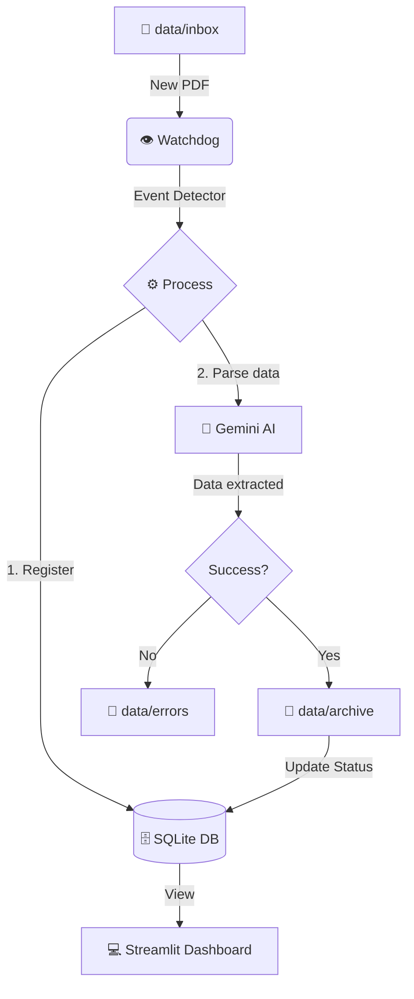

# 📑 Invoice AI Reader


⚠️ Note: This project is currently under active development as part of the Harvard CS50P course final project. Some features may be incomplete or subject to change.

**Invoice AI Reader** is an AI-powered document processing tool designed to automate data extraction from invoices using the **Google Gemini API**. It features a web interface for validation and a local database for persistence.

## 🚀 Features
* **Automated Extraction:** Uses Gemini 1.5 Flash to read PDFs and images.
* **Human-in-the-Loop:** Streamlit dashboard to verify and edit extracted data.
* **Local Storage:** Saves structured data into a SQLite database.
* **Modern Tooling:** Managed with `uv` for lightning-fast dependency management.

## 🤖 Tech Stack
* **Language:** Python 3.12+
* **AI Model:** Google Gemini (Generative AI)
* **Frontend:** Streamlit
* **Database:** SQLite
* **Environment:** `uv`

## 🔀 Flowchart


## 📂 Project Structure Plan
```
invoice-ai-reader/
├── data/               # Invoice PDFs/Images
│   ├── inbox/          # Input folder for invoice PDFs/Images to be processed
│   ├── archive/        # Archive folder for processed files with success
│   └── errors/         # Error folder for processed files with errors
├── database/           # SQLite database storage
├── src/                # Source code
│   ├── config.py       # Project configuration file get secrets, set paths, etc.
│   ├── app.py          # Streamlit web dashboard
│   ├── extractor.py    # Gemini API integration & logic
│   └── database.py     # SQL database management & schemas
├── tests/              # Unit and integration tests
├── .env                # API Keys and secrets (Local only)
├── .env.example        # TODO: Variables examples list for github
├── .gitignore          # Git ignore rules
├── pyproject.toml      # Project dependencies and metadata (uv)
└── README.md           # Project documentation
```

## 🛠️ Roadmap / To-Do
- [x] Initial project structure and Git setup.
- [x] Database schema design (SQLite).
- [ ] Database management functions.
- [ ] Watchdog file monitor.
- [ ] Gemini API integration for PDF/Image parsing.
- [ ] Streamlit dashboard development.
- [ ] Data validation logic.
- [ ] Final project submission and video demo.

## 📚 References
* **Gemini API docs for PDF:** https://ai.google.dev/gemini-api/docs/document-processing
* **Gemini API docs for Image:** https://ai.google.dev/gemini-api/docs/image-understanding
* **Watchdog library docs:** https://python-watchdog.readthedocs.io/en/stable/api.html#module-watchdog.observers
* **python-dotenv library docs:**  https://pypi.org/project/python-dotenv/
* **Streamlit docs:** https://docs.streamlit.io/
* **SQLite3 docs:** https://www.sqlite.org/docs.html


## 📦 Installation & Setup
* TODO once finished the first version.